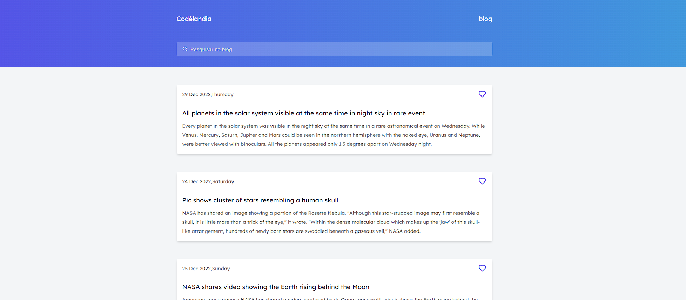

# Blog

<!---Esses são exemplos. Veja https://shields.io para outras pessoas ou para personalizar este conjunto de escudos. Você pode querer incluir dependências, status do projeto e informações de licença aqui--->
<p align="center">
  
</p>

> Desafio 01 - Blog da Codelandia.

### Ajustes e melhorias

O projeto ainda está em desenvolvimento e as próximas atualizações serão voltadas nas seguintes tarefas:

- [x] Barra de Pesquisa
- [x] API de Noticias.
- [x] Carregamento dos Artigos com formato de Esqueleto (Skeleton Loading).
- [x] Ajuste na Documentação.
- [x] Favoritos no Gerenciamento de Estado Global.
- [x] Artigos no Gerenciamento de Estado Global.
- [x] Lista de Favoritos.

## 💻 Pré-requisitos

Antes de começar, verifique se você atendeu aos seguintes requisitos:
<!---Estes são apenas requisitos de exemplo. Adicionar, duplicar ou remover conforme necessário--->
* NPM.

## 🚀 Instalando Blog

Para instalar o Blog, siga estas etapas:


Clone este repositório
```
git clone <nome do repositorio>
```

Instale as dependencias
```
npm install 
```

## ☕ Usando Blog

Para usar Blog, siga estas etapas:

```
npm run dev
```

## 🤝 Colaboradores

Agradecemos às seguintes pessoas que contribuíram para este projeto:

<table>
  <tr>
    <td align="center">
      <a href="#">
        <br>
        <sub>
          <b>Guilherme S Barros</b>
        </sub>
      </a>
    </td>
  </tr>
</table>

## 📝 Licença

Esse projeto está sob licença. Veja o arquivo [LICENÇA](LICENSE.md) para mais detalhes.

[⬆ Voltar ao topo](#blog)<br>
